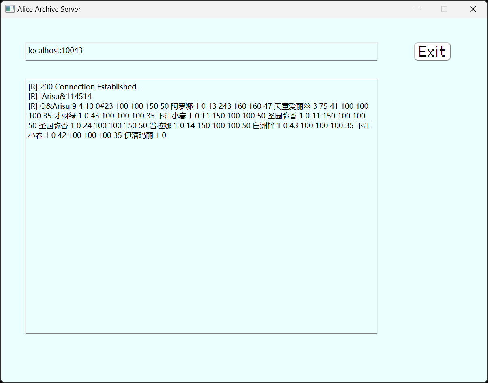

# Alice Archive
面向对象程序设计实践（C++） 课程设计作业：宠物小精灵对战系统  

## 介绍
**邦邦咔邦**，这里是女仆勇者爱丽丝AL-1S！  
今天打算去冒险什么呢？爱丽丝已经做好一起出发的准备了。  

在这里，我们需要设计并加入宠物小精灵。
1. 设计宠物小精灵的类：精灵的属性包括种类、名字、等级、经验值、攻击力、防御力、生命值、攻击间隔等。每个精灵初始等级为 1，满级 15 级，每当精灵升级的时候，宠物对应的属性
值会有少量增加。每个精灵有自己独特的攻击方式，如“闪电攻击”，“火焰攻击”等等，需要设计一个精灵的基类，并将精灵的攻击方法设为虚方法以方便子类重写  
2. 实现用户注册与平台登录：实现注册、登录、登出功能，均采用 C/S 模式，客户端和服务端用 `socket` 进行通信，服务端保存所有用户的信息。每个用户拥有：用户名、拥有的精灵，两个属性；用户注册成功时，系统自动随机分发三个 1 级精灵给用户。用户可以查看所有成功注册用户拥有的精灵，也可以查看所有当前在线的用户
3. 游戏对战的设计：已经登录的在线用户可以和服务器进行虚拟决斗，决斗分两种：升级赛和决斗赛；系统自动模拟每场比赛的每次出招等  

> 勇士啊。光芒与你同在！

## 项目

本项目基于Qt工具箱并使用C++编写  

相关设计元素：Blue Archive 蔚蓝档案 蔚藍檔案 © NEXON  

有关素材使用：  
1. Logo生成：[BlueArchive-Style Logo Generator](https://lab.nulla.top/ba-logo)  
2. 头图：PID [110486537](https://www.pixiv.net/artworks/110486537)  
3. 大头素材：作者UID [51776118](https://www.pixiv.net/users/51776118)  

如有侵权行为，请与我联系，将会及时处理和回复，谢谢！

## 构建

本项目分为客户端和服务端系统  
  
其中`AliceArchive_server.pro`及以`_server`开头的文件或一级目录为服务端系统Qt源文件  
`AliceArchive.pro`及其它文件或一级目录为客户端系统Qt源文件  
  
本项目开发与测试环境构建套件为 `Desktop Qt 6.6.3 MinGW 64-bit`  
其它环境可自行调整适配

## 运行

如下为本程序运行演示相关页面：

### 客户端

#### 主页面

#### 注册与登录页面

### 服务端

本页面用于展示运行过程中，服务端的相关运行参数与接受到的socket信息内容

